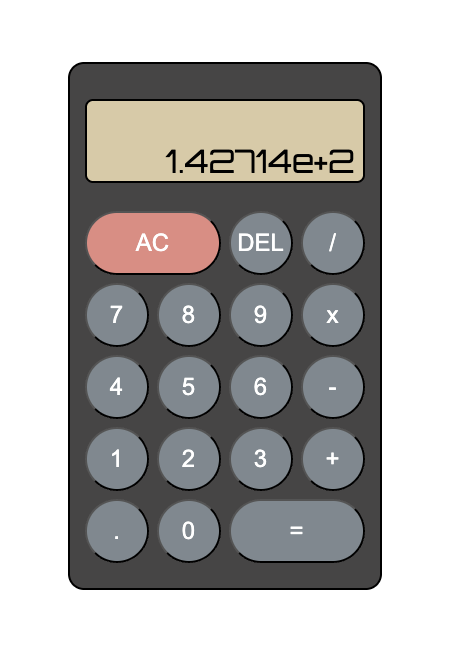

# simple-calculator

A responsive, keyboard-accessible calculator built using HTML, CSS, and JavaScript. This project demonstrates how to build a clean, interactive calculator UI with full keyboard support, basic arithmetic operations, and some edge-case handling like division by zero.

---

## Features

- Perform basic arithmetic: **Addition, Subtraction, Multiplication, Division**
- Keyboard and mouse input support
- `AC` button to clear everything
- `DEL` button to delete the last digit
- Decimal support and result rounding
- Prevents overflow beyond 9 digits
- Handles divide-by-zero errors gracefully

---

## How to Run

1. Clone or download this repository.
2. Open the `index.html` file in any modern browser (Chrome, Firefox, Edge, etc.).
3. Start calculating using your **mouse** or **keyboard**!

---

## Keyboard Shortcuts

| Key         | Function            |
|-------------|---------------------|
| `0-9`       | Input digits         |
| `+ - * /`   | Arithmetic operators |
| `.`         | Decimal point        |
| `Enter` / `=` | Calculate         |
| `Backspace` | Delete last digit   |
| `Escape`    | Clear (AC)          |

---

## Logic Overview

- **Display updates** in real-time using the `screen` div.
- `operate()` handles computation based on selected operator.
- Uses **event delegation** for both **click** and **keyboard** events.
- Division by zero returns `"Nope"` and disables further input until reset.

---

## License

None, anyone can use this, idc.

---

Font used is Orbitron from google fonts.